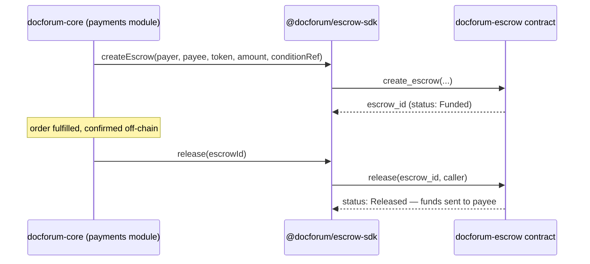

# docforum-escrow


**🔗 Live on testnet:** [`CABSYY5FZGCCZ3UTBQGC7S357D2FUFLUQUUGJCCFHKGEJZVIFK4SIS2Z`](https://stellar.expert/explorer/testnet/contract/CABSYY5FZGCCZ3UTBQGC7S357D2FUFLUQUUGJCCFHKGEJZVIFK4SIS2Z) — deployed and verified with a real `create_escrow` call, not just uploaded. Details: [`docs/testnet-deployments.md`](docs/testnet-deployments.md).

A [Soroban](https://developers.stellar.org/docs/build/smart-contracts) (Stellar) smart contract for conditional payment escrow — lock funds, and release them to the payee only when release is authorized, or return them to the payer on refund. Paired with a TypeScript client SDK, `@docforum/escrow-sdk`.

This repo is deliberately **generic and domain-agnostic**. It has no
database, no server, and no knowledge of patients, doctors, referrals, or
any other healthcare concept — it is a reusable create/release/refund
escrow primitive, in the same category as other Stellar ecosystem escrow
projects (e.g. Trustless Work). Anything domain-specific — what condition
triggers a release, who the parties are — lives in the consuming
application, not here.

## Table of contents

- [Why this repo exists](#why-this-repo-exists-honestly)
- [Contract surface](#contract-surface)
- [How it's used](#how-its-used)
- [Repo layout](#repo-layout)
- [Getting started](#getting-started)
- [Documentation](#documentation)
- [Project status](#project-status)
- [Contributing](#contributing)
- [License](#license)

## Why this repo exists, honestly

Two reasons, stated plainly rather than blended together:

1. **Product reason.** [`docforum-core`](https://github.com/DocForum/docforum-core)'s facility-fulfillment flow needs a way to hold payment until a facility confirms it did the work, without trusting the facility's self-report alone.
2. **Ecosystem reason.** This is the one piece of the `DocForum` organization that's actually built *on* Stellar, as opposed to an application that merely accepts Stellar payments — see [`docforum-core`'s ADR 0002](https://github.com/DocForum/docforum-core/blob/main/docs/adr/0002-stellar-escrow-for-fulfillment-payout.md) for why that distinction shaped how the org is structured, and [`docs/adr/0001-generic-escrow-not-healthcare-specific.md`](docs/adr/0001-generic-escrow-not-healthcare-specific.md) for why the contract itself stays domain-blind.

## Contract surface

| Function | Status | Description |
|---|---|---|
| `create_escrow(payer, payee, token, amount, condition_ref) -> escrow_id` | ✅ Implemented | Pulls `amount` of `token` from `payer` (requires `payer` auth), stores an opaque `condition_ref`, sets status `Funded`. Rejects non-positive amounts. |
| `get_status(escrow_id) -> EscrowStatus` | ✅ Implemented | Read-only. Errors on an unknown id. |
| `release(escrow_id, caller) -> Result<()>` | 🚧 Phase E2 — [issue #2](https://github.com/DocForum/docforum-escrow/issues/2) | Restricted to a designated releaser role; moves funds to `payee`. |
| `refund(escrow_id, caller) -> Result<()>` | 🚧 Phase E2 — [issue #3](https://github.com/DocForum/docforum-escrow/issues/3) | Restricted similarly; returns funds to `payer`. |

```
EscrowStatus = Funded | Released | Refunded
```

**Design rule, enforced deliberately:** the contract decides **who** may
call `release`/`refund`, never **why**. `condition_ref` is an opaque
string the contract stores but never interprets — all domain
interpretation (what counts as "fulfilled," who's authorized to attest to
it) is the consuming application's job. See
[ADR 0001](docs/adr/0001-generic-escrow-not-healthcare-specific.md).

## How it's used



`docforum-core` imports `@docforum/escrow-sdk` as a **library dependency**
— it never calls this contract as a running network service, and this
repo never crosses back into `docforum-core`'s database or domain model.

## Repo layout

```
contracts/escrow/
  src/lib.rs        Contract implementation
  tests/            Integration tests (soroban-sdk testutils) — required for any contract change
  Cargo.toml
sdk/
  src/index.ts      @docforum/escrow-sdk — TypeScript client (not yet implemented, see issue #4)
  package.json
docs/adr/           Architecture decision records
.github/            CI workflow, issue/PR templates
```

## Getting started

Requires a Rust toolchain with the `wasm32v1-none` target.

```bash
git clone https://github.com/DocForum/docforum-escrow.git
cd docforum-escrow/contracts/escrow

# Run the test suite (4 tests, all passing today)
cargo test

# Build the deployable contract
cargo build --target wasm32v1-none --release
# → target/wasm32v1-none/release/docforum_escrow.wasm
```

Already deployed to Stellar **testnet** — see
[`docs/testnet-deployments.md`](docs/testnet-deployments.md) for the
contract id, transaction links, and the exact `stellar` CLI commands to
redeploy. **Mainnet is out of scope until the Phase E4 security review is
complete — see [hard rule 4](ARCHITECTURE_ESSENTIALS.md#hard-rules).**

The TypeScript SDK (`sdk/`) is still a placeholder — see
[issue #4](https://github.com/DocForum/docforum-escrow/issues/4).

## Documentation

| Doc | Purpose |
|---|---|
| [`ARCHITECTURE_ESSENTIALS.md`](ARCHITECTURE_ESSENTIALS.md) | Stack, contract surface, hard rules (no PHI ever, tests required for contract changes, testnet-only until security review). |
| [`ROADMAP.md`](ROADMAP.md) | Phase E1–E4 breakdown and current status. |
| [`AGENTS.md`](AGENTS.md) / [`CLAUDE.md`](CLAUDE.md) | Rules for coding agents working in this repo — read `README.md` + `ARCHITECTURE_ESSENTIALS.md` first; you should rarely need `docforum-core`'s docs to work here. |
| [`docs/adr/0001-generic-escrow-not-healthcare-specific.md`](docs/adr/0001-generic-escrow-not-healthcare-specific.md) | Why the contract stays domain-blind. |

## Project status

**Phase E1 (contract skeleton): done.** `create_escrow` and `get_status`
are implemented, tested, and deployed live on testnet — not just locally
tested. Phases E2 (release/refund), E3 (TypeScript SDK), and E4 (security
review, blocking for any mainnet use) are tracked as open issues:

| Issue | Phase | Complexity |
|---|---|---|
| ~~#1 Deploy to testnet~~ — done, see above | E1 | Trivial |
| [#2 Implement `release()`](https://github.com/DocForum/docforum-escrow/issues/2) | E2 | High |
| [#3 Implement `refund()`](https://github.com/DocForum/docforum-escrow/issues/3) | E2 | High |
| [#4 SDK: wrap `create_escrow`/`get_status`](https://github.com/DocForum/docforum-escrow/issues/4) | E3 | Medium |
| [#5 ADR: npm vs GitHub Packages](https://github.com/DocForum/docforum-escrow/issues/5) | E3 | Trivial |
| [#6 Threat model + external security review](https://github.com/DocForum/docforum-escrow/issues/6) | E4 | High |

Full breakdown: [`ROADMAP.md`](ROADMAP.md).

## Contributing

Issues are scoped as small, independent units with a stated complexity
(Trivial/Medium/High) — see the
[good-first-issue template](.github/ISSUE_TEMPLATE/good-first-issue.md).
Any contract logic change **must** include tests in `contracts/escrow/tests/`
in the same PR — see `AGENTS.md` hard rules. This repo targets the Stellar
ecosystem's [Drips Wave](https://docs.drips.network/wave/) program; see
`docforum-core`'s
[ADR 0002](https://github.com/DocForum/docforum-core/blob/main/docs/adr/0002-stellar-escrow-for-fulfillment-payout.md)
for the readiness plan.

## License

[Apache License 2.0](LICENSE)
